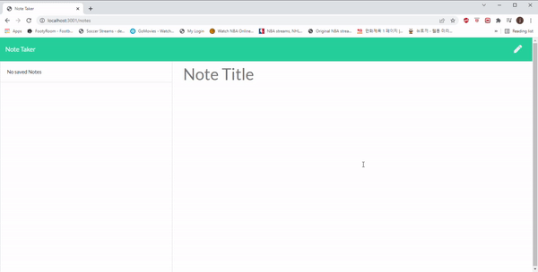

# Note-Taker
<h1>Note-Taker</h1>
  
<p>Team-Profile-Generator builds a team-displaying HTML file for a user based on their input. The user inputs a team name, a how many members will be on their team and what their roles will be, and the program generates a static page organizing their information.</p>
  
 ## User Story
 ```
AS A small business owner
I WANT to be able to write and save notes
SO THAT I can organize my thoughts and keep track of tasks I need to complete
```

 <br>
  
</p>
  <h2>Table of Contents</h2>
  <ul> 
   <li><a href="#Installation">Installation</a></li> 
   <li><a href="#Usage">Usage</a></li>   
   <li><a href="#Contributing">Contributing</a></li>   
   <li><a href="#Questions">Questions</a></li>                         
  </ul>
  <h2 id="Installation">Installation</h2>                         
  <p>
  <ol>
<li>Clone this repository.<pre><code> git <span class="hljs-keyword">clone</span> <span class="hljs-title">https</span>://github.com/zhkim3/Note-Taker.git
</code></pre></li>
<li>Install Nodejs dependencies.<pre><code> npm <span class="hljs-keyword">install</span>
</code></pre></li>
<li>In the root directory of the project, start the app.<pre><code> <span class="hljs-keyword">node</span> <span class="hljs-title">server</span>.js
</code></pre></li>
</ol>
  <h2 id="Usage">Usage</h2>
  <p>This application can be used to write and save notes by using node .\server.js. 
  <h2 id="Contributing">Contributing</h2>
  <p>Anyone is free to contribute to this application. Being an open source community makes the Dev community special. Any contributes are appreciated. </p>
  <h2 id="Questions">Questions</h2>
  <p style="strong">Any questions regarding this project, contact zhkim3@gmail.com directly.</p> 